# Sagemaker Cloudformation Stack Deployment Pipeline

## 1 Sign in

### 1.1 Login Credentials

If you use the AWS Console link, the account alias is pre-filled. For IAM user name, provide your
Philips email address.

- 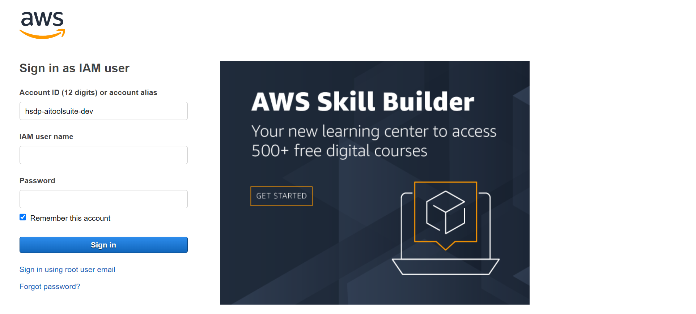

Note: The AWS access key and password are for programmatic access, so you do not need them
here.

### 1.2 Personas

Directly log on HSDP Development account, not switch to a different role.

## 2 Workflow for Sagemaker Cloudformation Stack Deployment Pipeline

### 2.1 Start AWS console and select Cloudformation service

- 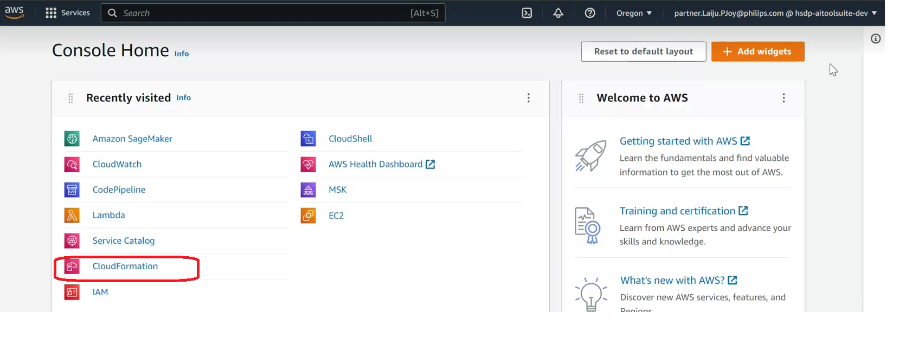

### 2.2 Start to create Cloudformation

- 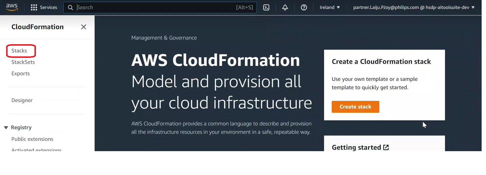

- 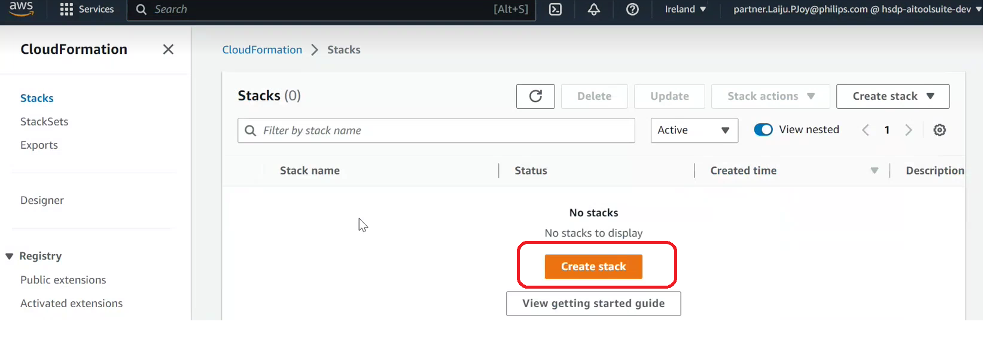

- 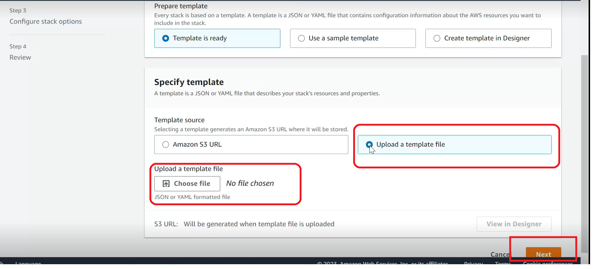

Select Stacks from cloudformation, and choose create stack option, after that upload manually a specified cloudformation template.

Use the Cloudformation template from the git repo https://github.com/philips-internal/HSP_PS_AIToolSuite/blob/master/Source/mlops/src/mlops_entry_point.yaml

The Cloudformation template file name is "mlops_entry_point.yaml", upload this file as Cloudformation template.

### 2.3 Provide required stack details

- 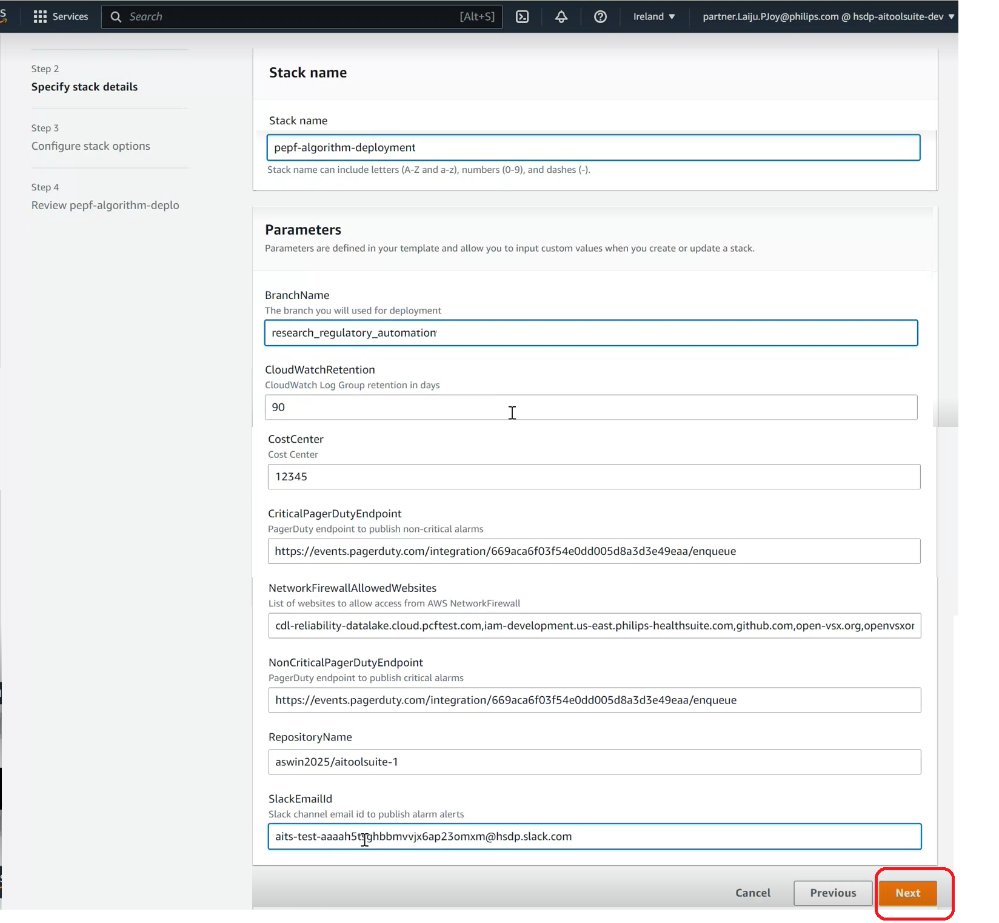

The required cloudformation stack details are provide manually in specified tabs.

### 2.4 Configure stack options

- 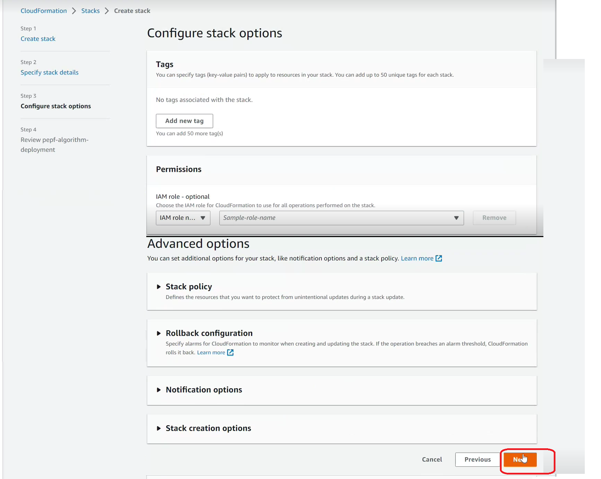

We can include tags, stack policy and Rollback configuration here, in default case skip this options.

### 2.5 Verify stack config details

- 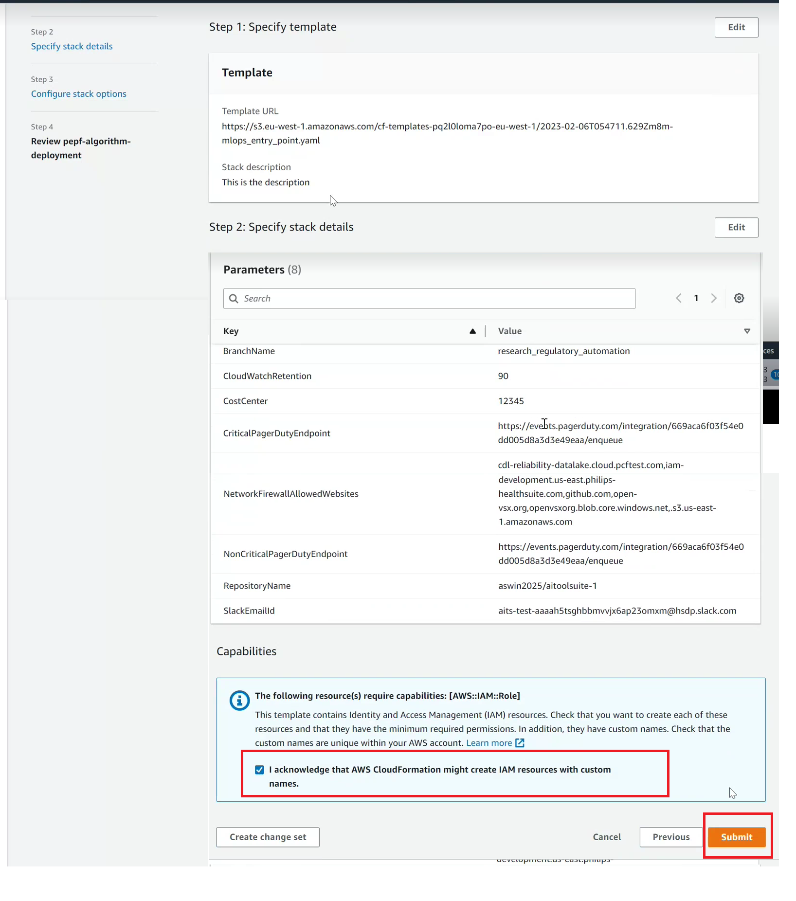

Here, verify the user provided stack details, if everything correct, click on acknowlekdgement option and Submit. 

### 2.6 Verify Cloudformation Stack creation

- 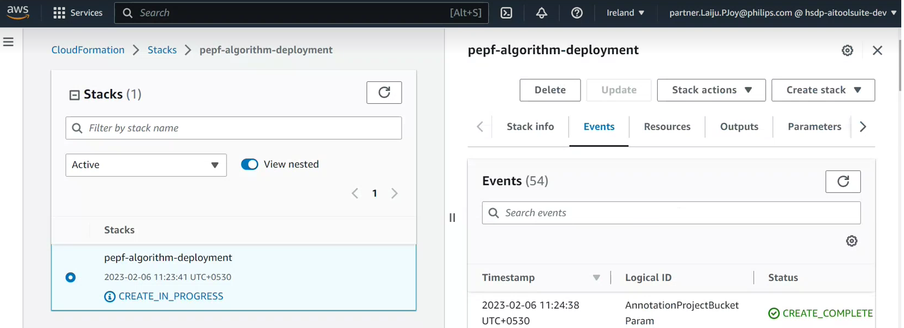

In Cloudformation service, select stack then we will see new cloudformation stacks are create in progress.

### 2.7 Verify Pipeline Status

- 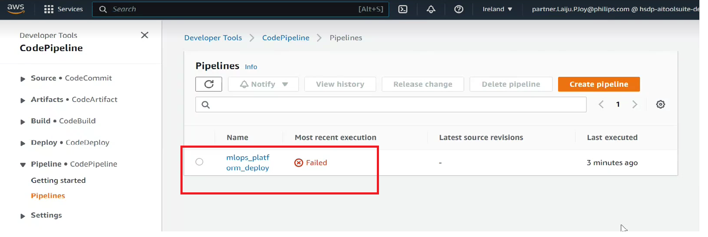

Verify the pipeline status in CodePipe line service, we will see Pipeline execution is "Failed" status, 
because we are not provide yet infrastructure details from specific git repo where infrastructure is available.

### 2.8 Initiate github connection for provide infrastructure

These are the following steps for initiate github connection to the build pipeline.
Choose the specific git user and repository where the infrastructure script is available, and create the connection.

- 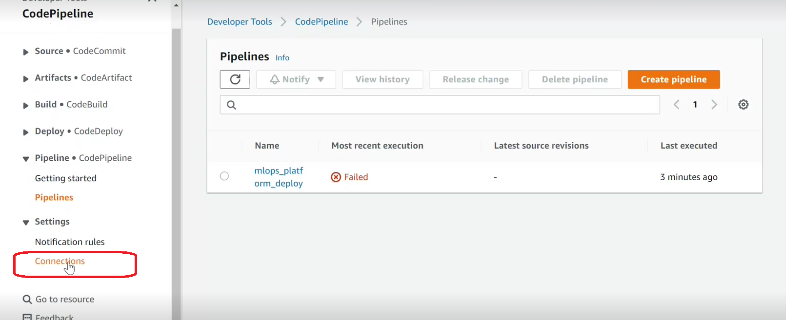

- 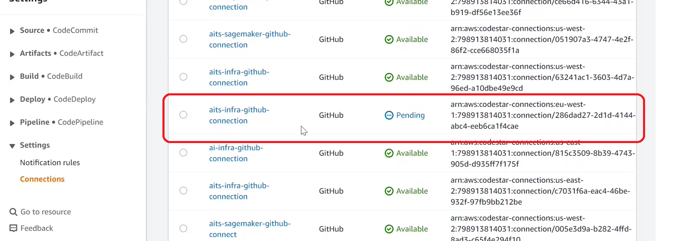

- 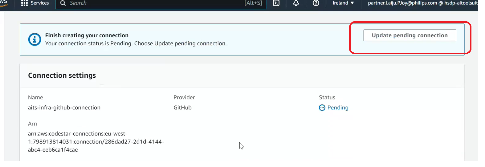

- 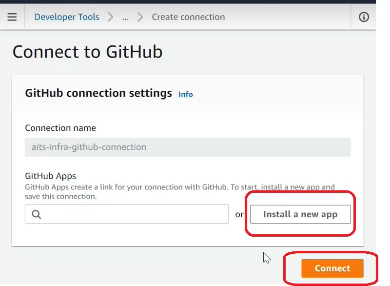

- 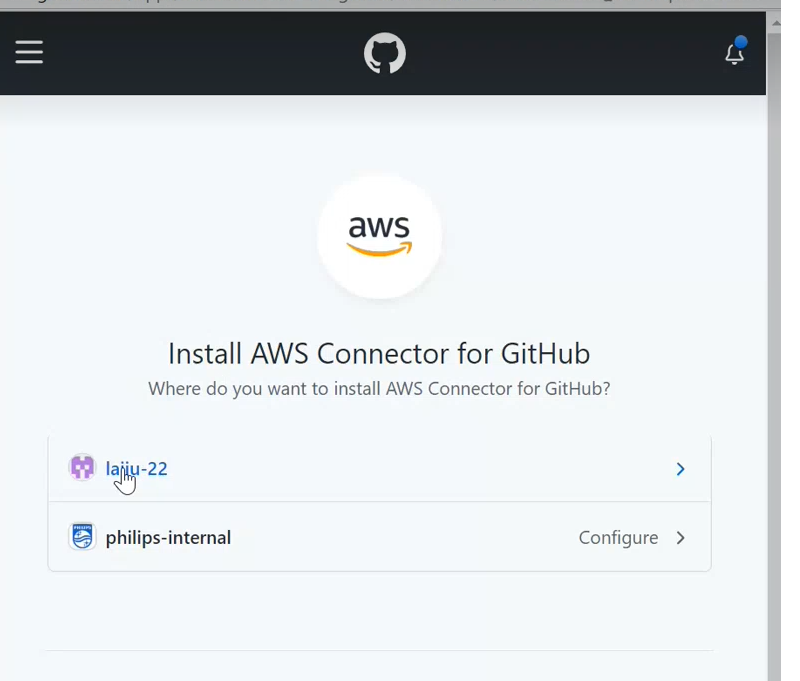

- 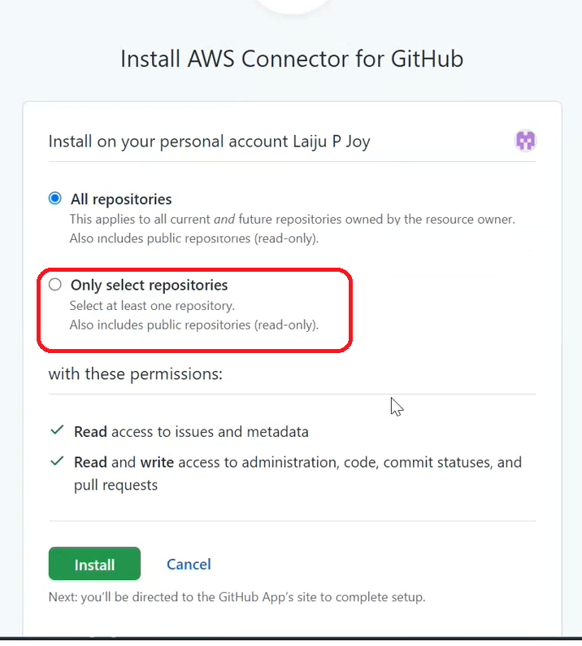

### 2.9 Initiate the release changes

After established the connection with git repository, follow the bellow steps for release the changes in CodePipeline,
and re-initiate the cloudformation infrastructure deployment.

- 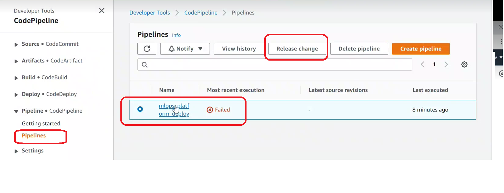

- 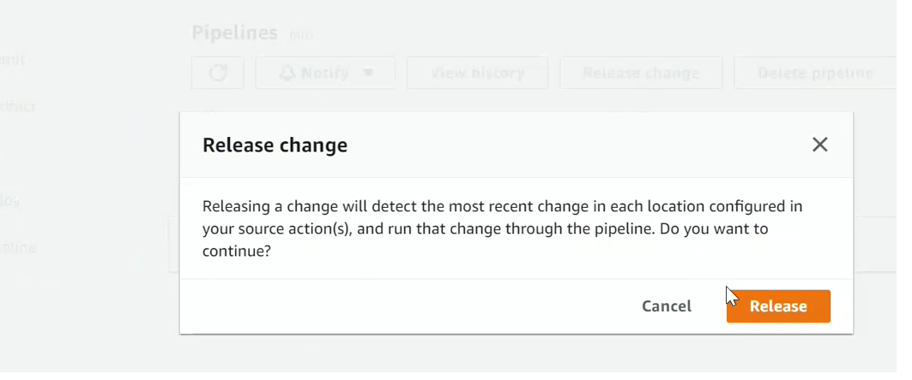

### 2.10 Pipeline Build Execution Restart and Deploying Infracture

Pipeline build execution restart and deploy the cloudformation infrastructure.

- 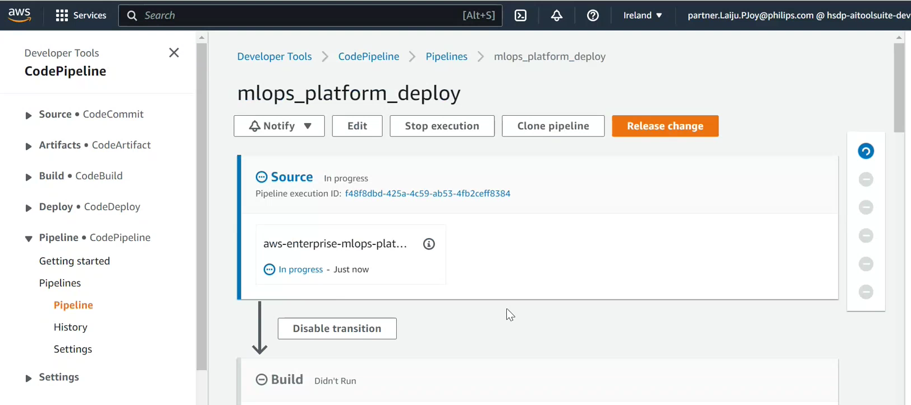

- 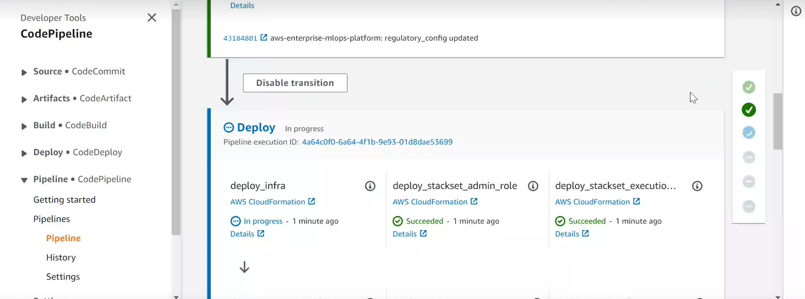

- 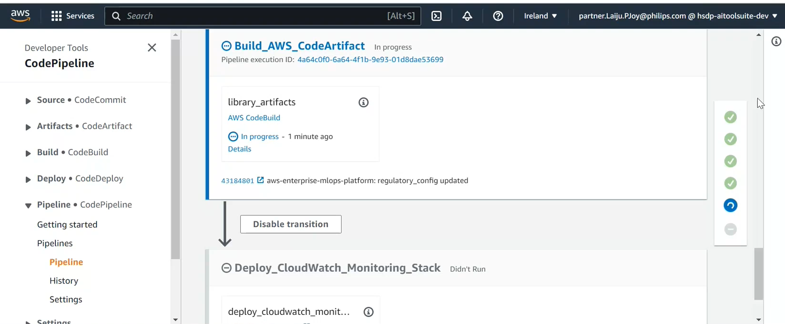

- 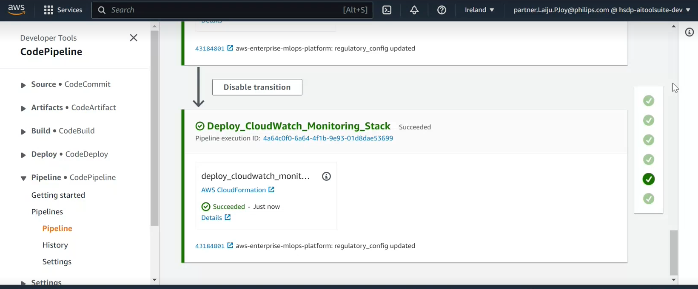

