# Sagemaker Cloudformation Stack Deployment Pipeline

## 1 Sign in

### 1.1 Login Credentials

If you use the AWS Console link, the account alias is pre-filled. For IAM user name, provide your
Philips email address.

- 

Note: The AWS access key and password are for programmatic access, so you do not need them
here.

### 1.2 Personas

Directly log on HSDP Development account and initiate the Sagemaker Cloudformation Stack Deployment Pipeline, not switch to a different role.

## 2 Workflow for Sagemaker Cloudformation Stack Deployment Pipeline

### 2.1 Start AWS console and select Cloudformation service

- 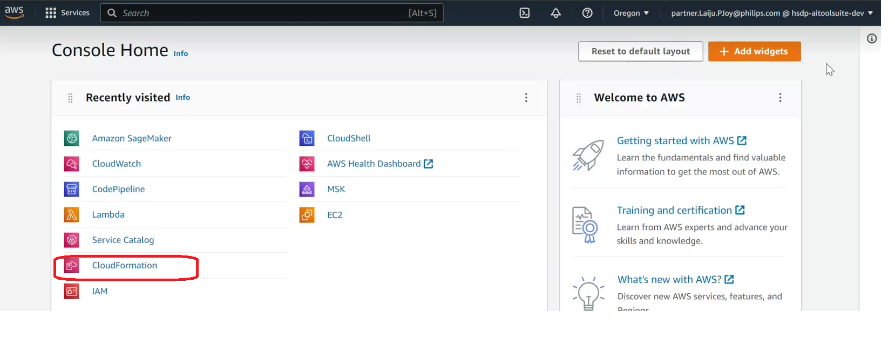

### 2.2 Start to create Cloudformation

- 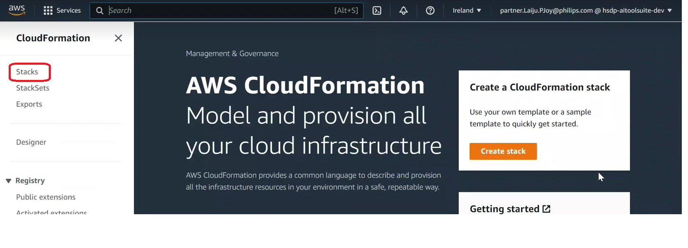

- 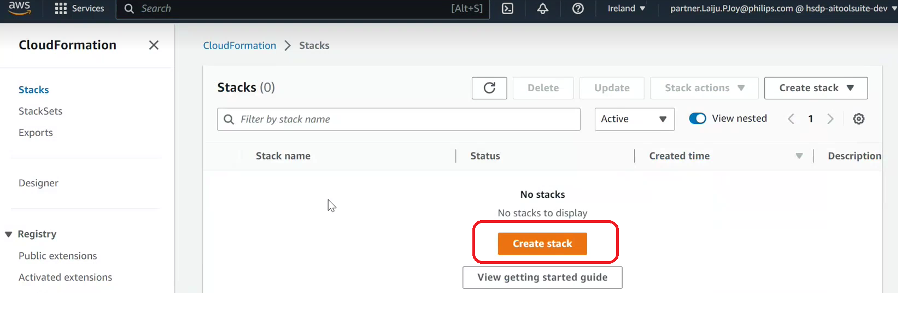

- 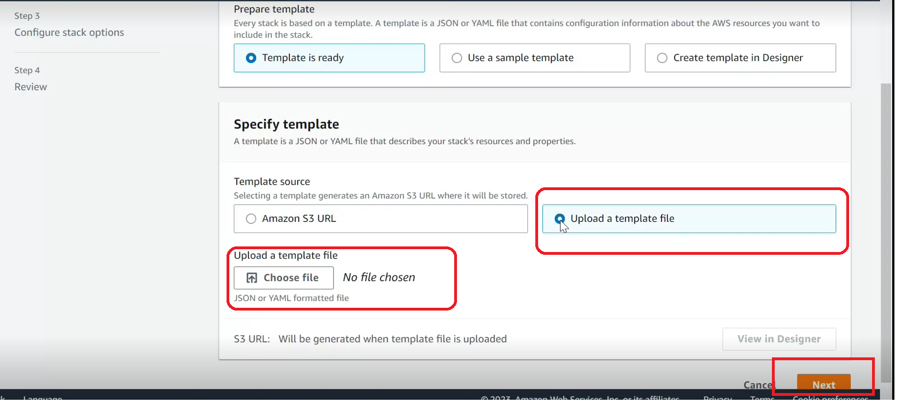

Choose the Cloudformation template from the git repo https://github.com/philips-internal/HSP_PS_AIToolSuite/blob/master/Source/mlops/src/mlops_entry_point.yaml

The Cloudformation template file name is "mlops_entry_point.yaml", upload this file as Cloudformation template.

### 2.3 Provide required stack details

- 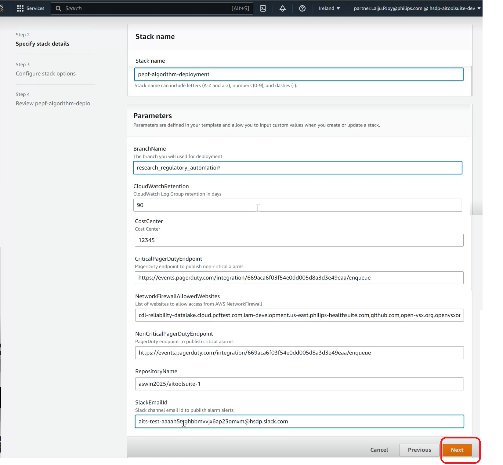

### 2.4 Configure stack options

- 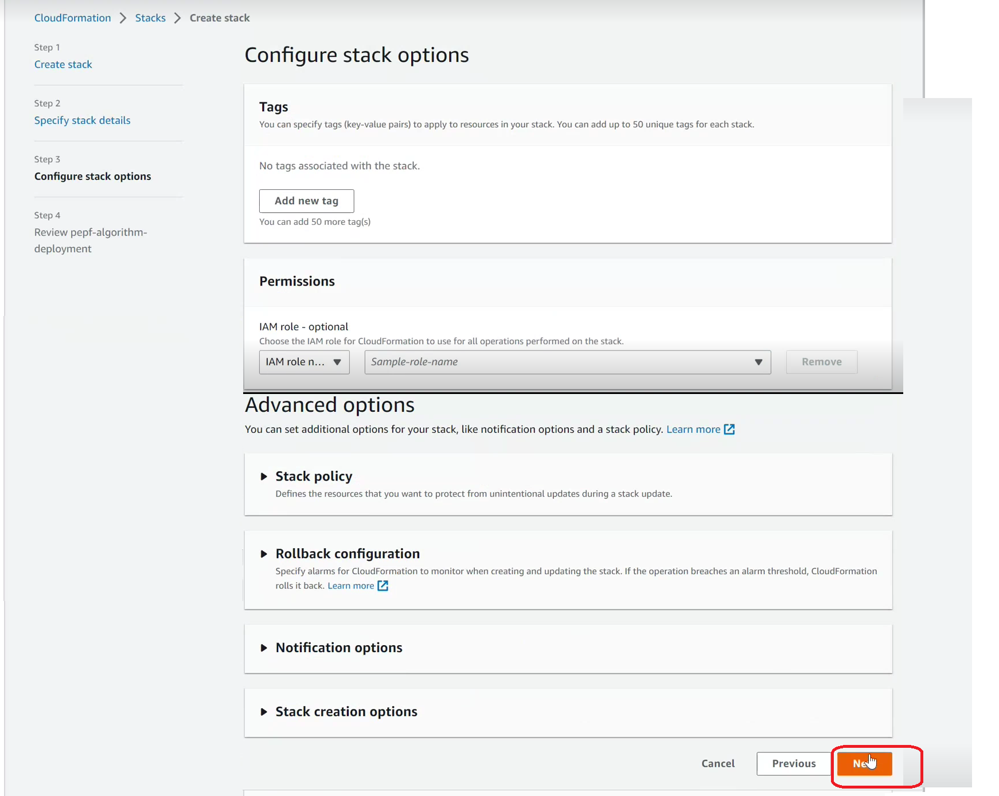

We can include tags, stack policy and Rollback configuration here, default case skip this options.

### 2.5 Verify stack config details

- 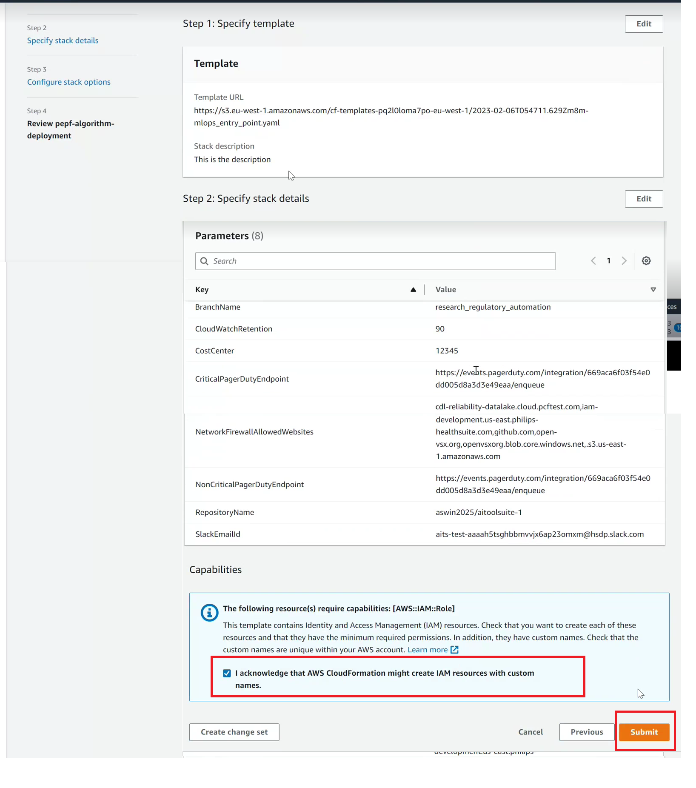

### 2.6 Verify Cloudformation Stack creation

- 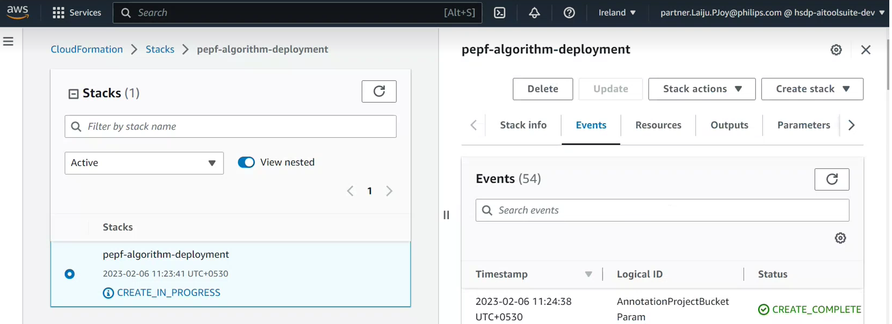

In Cloudformation service, select stack then we will see new cloudformation stacks are create in progress.

### 2.7 Verify Pipeline Status

- 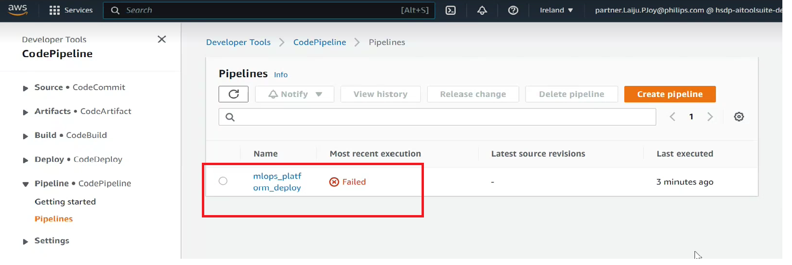

Verify the pipeline status in CodePipe line service, we will see Pipeline execution is "Failed" status, 
because we not provide a infrastructure script from specific git repo where infrastructure is available.

### 2.8 Initiate github connection

- 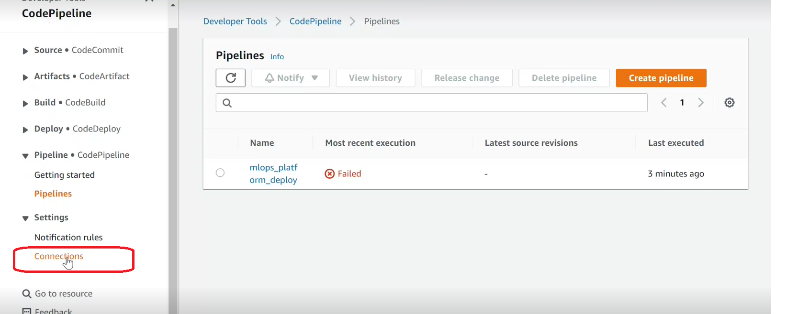

- 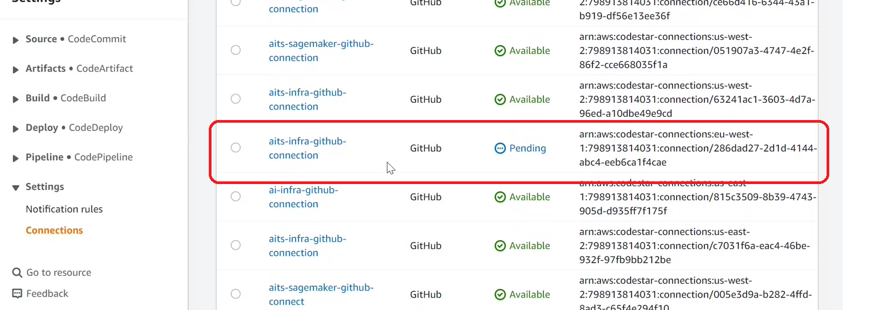

- 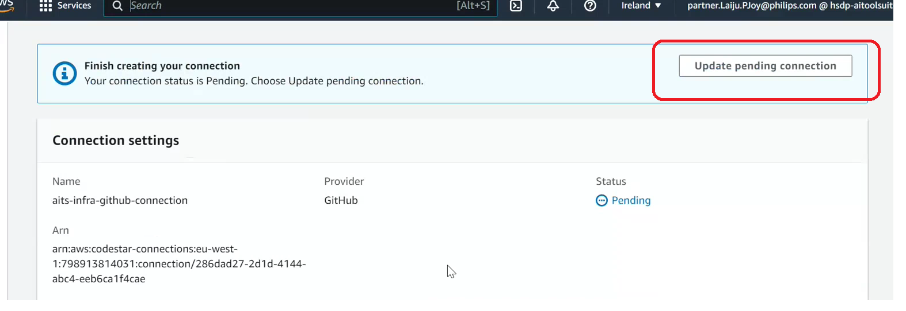

- 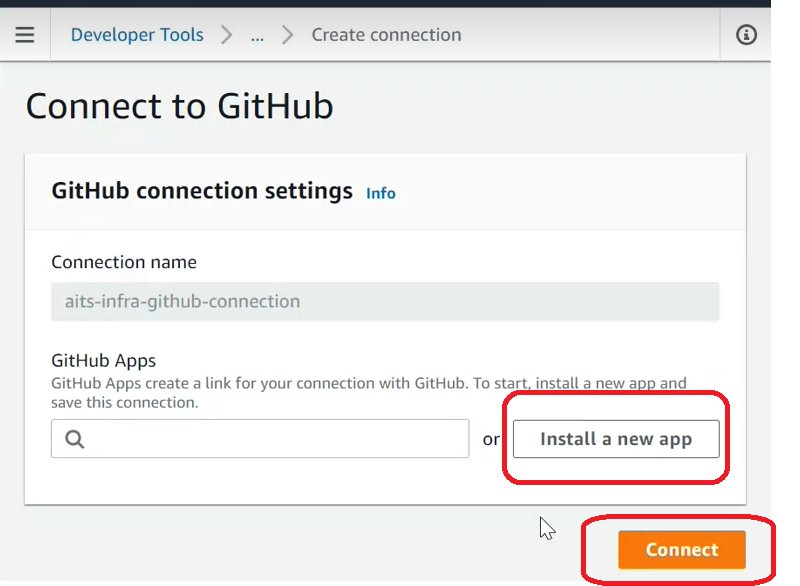

- 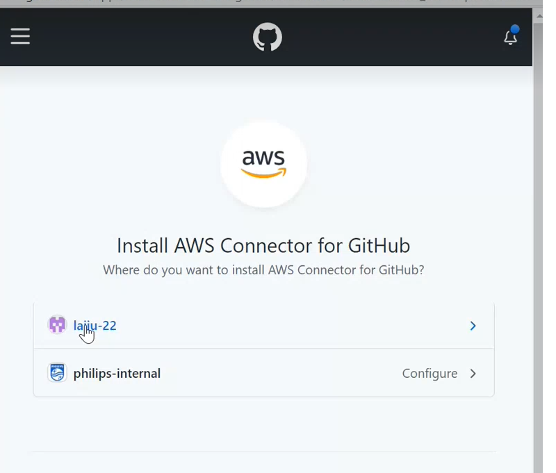

- 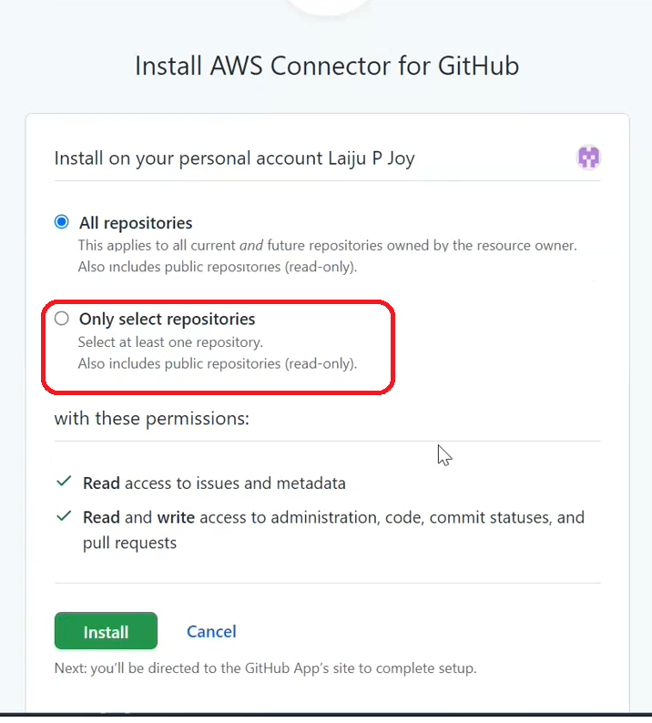

### 2.9 Initiate the release changes

- 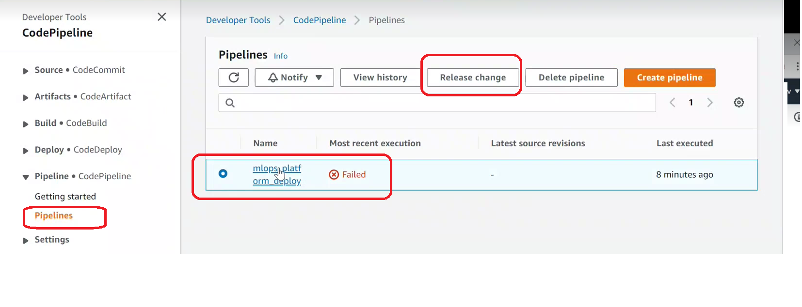

- 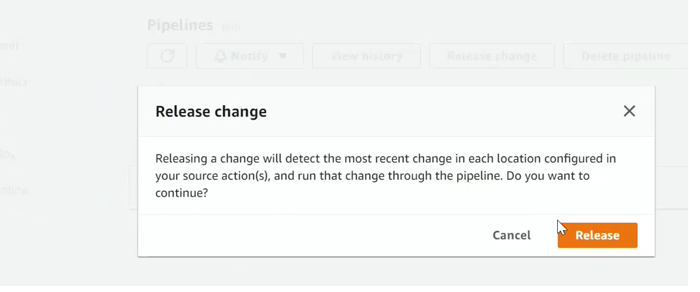

### 2.10 Pipeline Build Execution Restart and Deploying Infracture

- 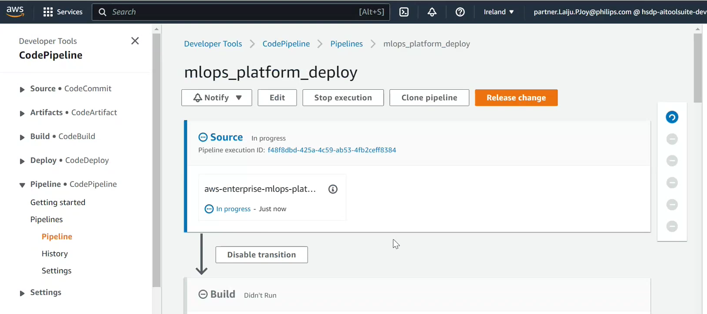

- 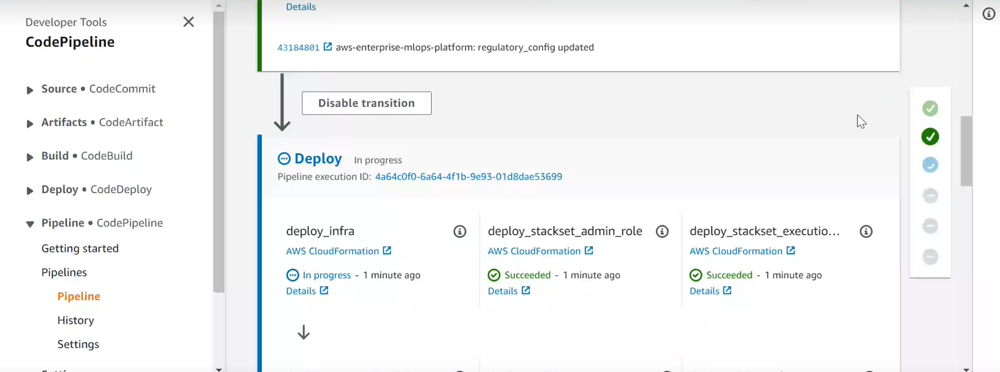

- 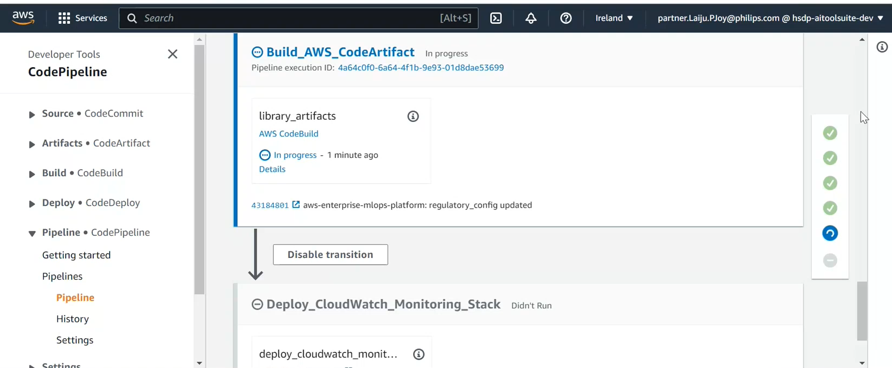

- 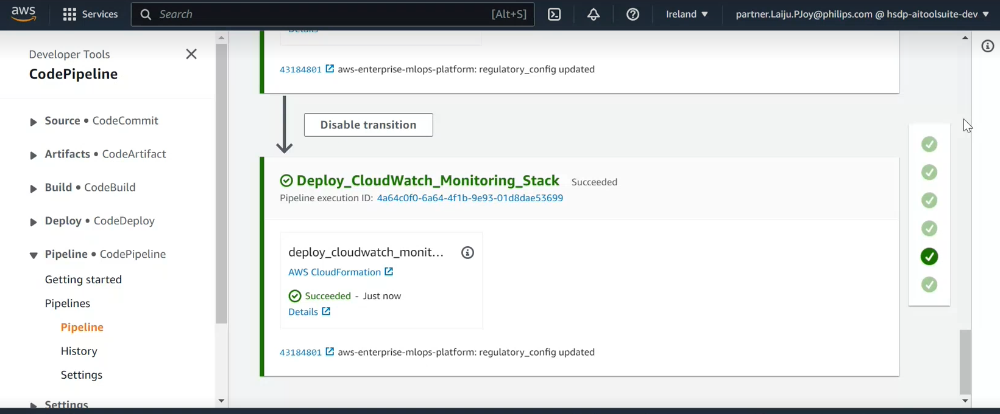

